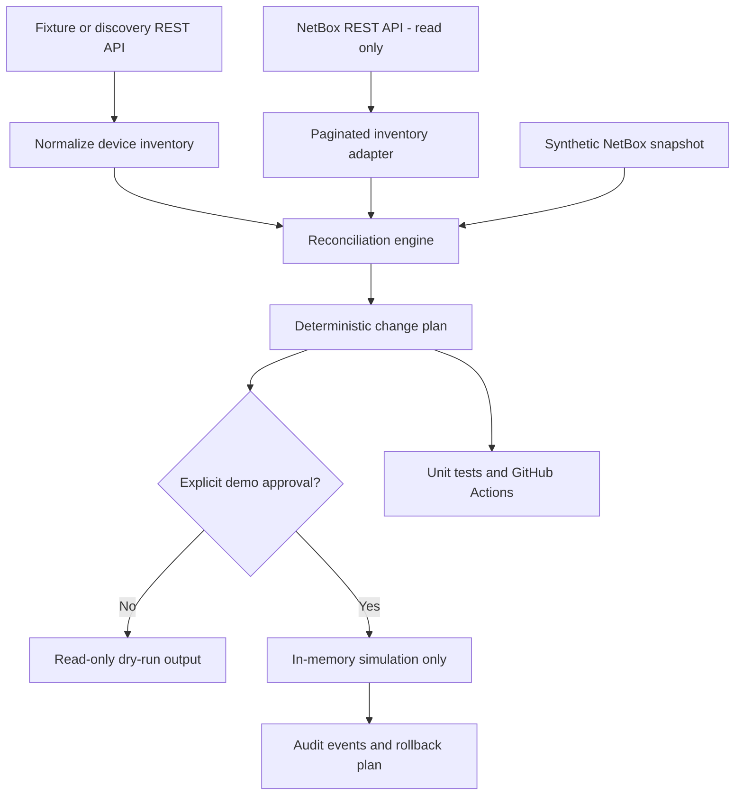

# Architecture and Design Decisions

## Purpose

This reference implementation demonstrates how a network automation platform can discover assets, normalize heterogeneous records, compare observed state against NetBox, and generate controlled change plans. The current implementation reads live NetBox inventory but **does not write to NetBox**. Its approval-gated execution and rollback capabilities are simulations operating on synthetic, in-memory inventory.

## Logical architecture



## Component boundaries

| Component | Responsibility | External side effects |
| --- | --- | --- |
| `src/discovery.py` | Fetch or load discovery records and normalize them | Optional read-only discovery HTTP request |
| `src/netbox_snapshot.py` | Fetch NetBox device pages and normalize device fields | Authenticated NetBox GET requests |
| `src/netbox_inventory.py` | Export NetBox devices to local CSV | NetBox reads; local file write |
| `src/reconcile.py` | Compare discovered and existing devices by name | None |
| `src/compare_live.py` | Combine fixture discovery with live NetBox reads and print a plan | NetBox reads; stdout |
| `src/controlled_sync.py` | Simulate approved changes, record audit events, generate rollback steps | Optional local audit file; no NetBox writes |

## Data flow and reconciliation

1. Collect discovered records from a fixture or a configured discovery endpoint.
2. Normalize identity and comparison fields: `name`, `serial`, `site`, `role`, `device_type`, `management_ip`, and `status`.
3. Obtain an existing-state inventory from a synthetic snapshot or the NetBox REST API.
4. Reject invalid or duplicate names. Compare devices deterministically by name.
5. Produce `create`, `update`, and `unchanged` sections. Existing records missing from discovery are **not deleted**.
6. Review the plan. A separate simulator can demonstrate approval, partial failure, audit events, and reversal of simulated operations.

Device-name identity is intentionally simple for this reference implementation. Production reconciliation should consider stable identifiers, renames, duplicate serials, scope boundaries, and authoritative field ownership.

## Security boundaries

- **Read-only NetBox integration:** The live NetBox adapter uses GET requests and should use a token with the minimum read permissions required.
- **Transport:** The live NetBox adapter requires HTTPS and refuses pagination URLs pointing to a different host.
- **Secrets:** Set `NETBOX_URL` and `NETBOX_TOKEN` locally. Never commit tokens or environment files.
- **Public examples:** Fixtures use fictional devices and documentation-only IP address ranges.
- **Generated artifacts:** Local exports and audit output are excluded from version control under `output/`.
- **Approval:** The explicit approval phrase only unlocks the **simulator**; it is not authorization for live infrastructure changes.

## Failure handling and recoverability

| Scenario | Current behavior | Production consideration |
| --- | --- | --- |
| Duplicate or unnamed devices | Reconciliation raises `ValueError` | Quarantine bad records and alert |
| NetBox request error or timeout | Propagates exception; no write attempted | Retry with bounded backoff and monitoring |
| Unexpected API payload | Rejects malformed pagination response | Version-aware schema validation |
| Pagination loop or cross-host next link | Rejects the request | Request tracing and incident alert |
| Demo operation failure | Stops simulated execution, preserves completed-operation rollback plan | Durable operation journal and idempotency keys |
| Device absent from discovery | No automatic deletion | Separate decommission workflow and human approval |

The rollback plan is valid only for the in-memory simulation. Real NetBox rollback would need object IDs, field-level dependency ordering, conflict detection, and verification of post-change state.

## Scale and reliability

The current live reader follows pagination sequentially and holds device records in memory. For larger inventories, introduce bounded concurrency where supported, incremental updates, scoped queries, request metrics, checkpointing, and API rate-limit handling. Inventory comparison is keyed by name and runs in linear time relative to the combined record count, aside from deterministic sorting.

## Design decisions

**ADR-001: Read-only live integration first.** Separate read access and reconciliation from mutation to make plans inspectable before granting write permissions.

**ADR-002: No automatic deletions.** Discovery gaps, API outages, or scope changes must not result in accidental device removals.

**ADR-003: Deterministic plans.** Stable ordering makes reviews, tests, and change tracking easier.

**ADR-004: Simulation before live writes.** Exercise approval and rollback logic without requiring a NetBox write token or production infrastructure.

**ADR-005: Tests without external services.** Mocked NetBox responses and synthetic fixtures make CI repeatable.

## Validation

Run from the repository root:

```bash
python -m unittest discover -s tests -v
python -m src.controlled_sync
```

For an authorized NetBox environment, set local credentials and run:

```bash
python -m src.compare_live
```

The second command makes read-only NetBox API requests and prints a change plan.

## Roadmap

1. Add a disposable Docker-based NetBox test environment.
2. Validate mapping against real NetBox schema versions and object relationships.
3. Add structured logging, metrics, bounded retries, and failure injection.
4. Define a separate, opt-in write adapter with least-privilege credentials, durable approvals, optimistic concurrency checks, idempotency, and post-change verification.
5. Integration-test rollback and recovery against disposable NetBox data before considering any real environment.
